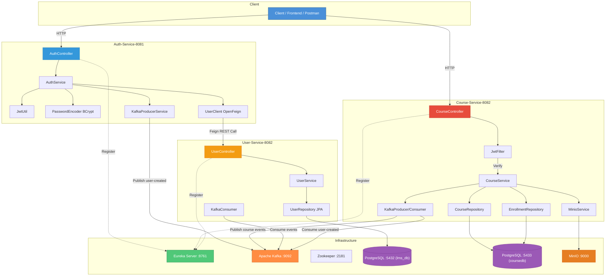
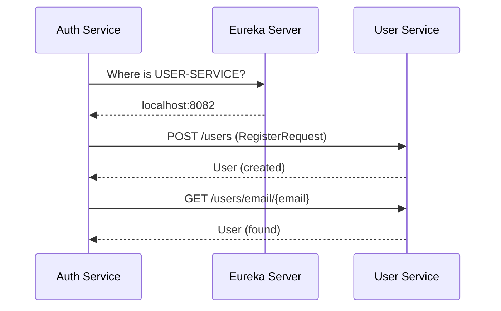
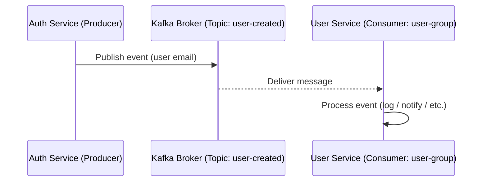
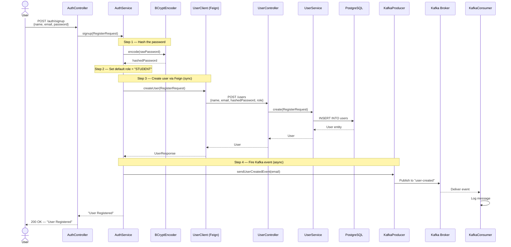
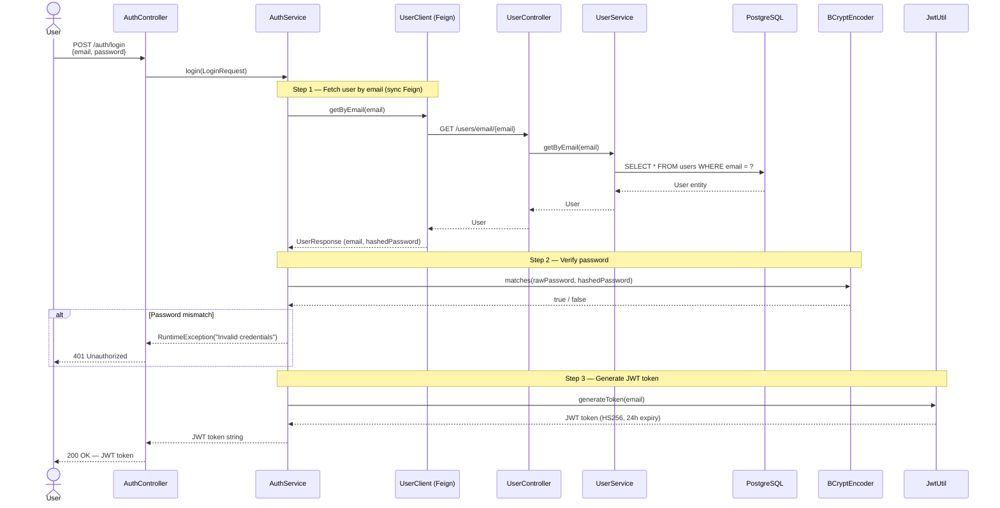
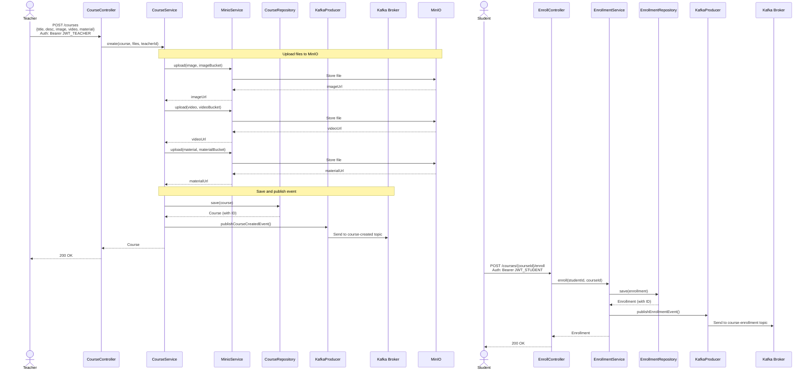
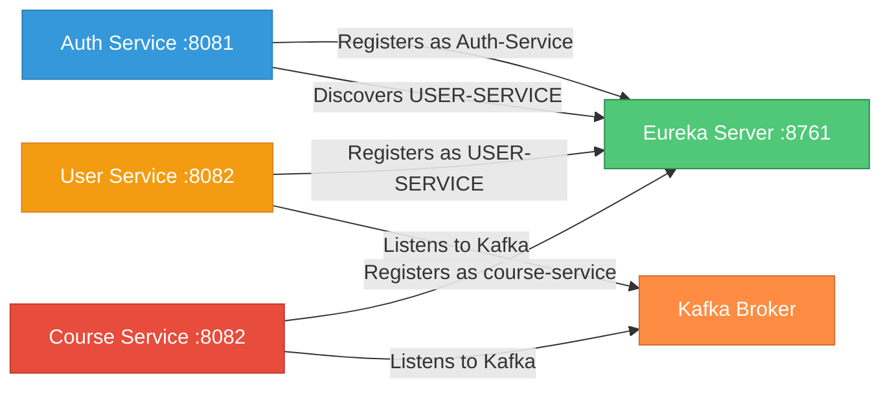
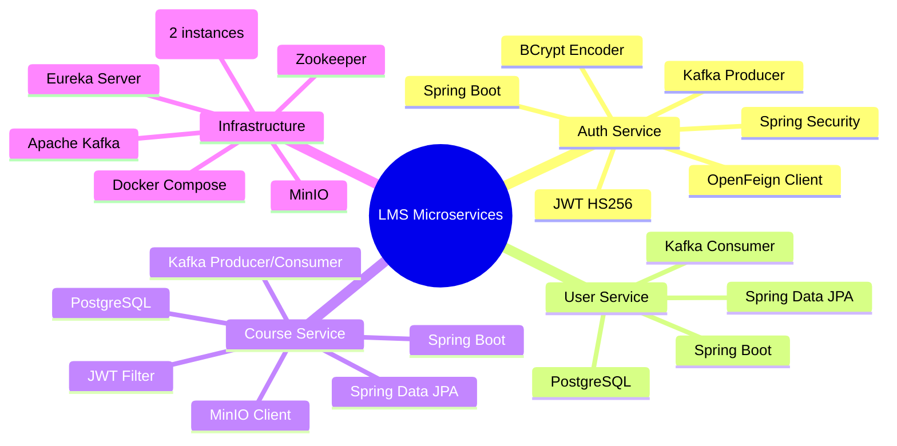

# Working Method Architecture — Auth Service, User Service & Course Service

> How the **Auth Service**, **User Service**, and **Course Service** communicate and work together inside the LMS microservice ecosystem.

---

## Table of Contents

- [System Overview](#system-overview)
- [High-Level Architecture](#high-level-architecture)
- [Service Responsibilities](#service-responsibilities)
- [Communication Patterns](#communication-patterns)
   - [Synchronous — OpenFeign (REST)](#1-synchronous--openfeign-rest)
   - [Asynchronous — Apache Kafka](#2-asynchronous--apache-kafka)
- [Registration Flow (Signup)](#registration-flow-signup)
- [Login Flow](#login-flow)
- [Course Creation & Enrollment Flow](#course-creation--enrollment-flow)
- [Service Discovery — Eureka](#service-discovery--eureka)
- [Technology Summary](#technology-summary)
- [File Structure Reference](#file-structure-reference)
- [Quick Start Guide](#quick-start-guide)

---

## System Overview

The LMS platform follows a **microservices architecture** with an **event-driven** layer. Three core services handle identity, user management, and course management:

| Service | Port | Spring Name | Purpose |
|---------|------|-------------|---------|
| **Auth Service** | `8081` | `Auth-Service` | Authentication (signup, login, JWT) |
| **User Service** | `8082` | `USER-SERVICE` | User CRUD, data persistence (PostgreSQL) |
| **Course Service** | `8082` | `course-service` | Course management, enrollment (PostgreSQL, MinIO) |
| **Eureka Server** | `8761` | `EurekaServer` | Service discovery & registry |

---

## High-Level Architecture



---

## Service Responsibilities

### Auth Service (Port 8081)

| Component | Class | Responsibility |
|-----------|-------|----------------|
| Controller | `AuthController` | Exposes `/auth/signup` and `/auth/login` endpoints |
| Service | `AuthService` | Orchestrates registration & login logic |
| Feign Client | `UserClient` | Synchronous HTTP calls to User Service |
| JWT Utility | `JwtUtil` | Generates & validates JWT tokens (HS256) |
| Security | `SecurityConfig` | Permits `/auth/**`, BCrypt password encoder |
| Kafka Producer | `KafkaProducerService` | Publishes `user-created` events |

### User Service (Port 8082)

| Component | Class | Responsibility |
|-----------|-------|----------------|
| Controller | `UserController` | Exposes `POST /users` and `GET /users/email/{email}` |
| Service | `UserService` | Creates users, looks up by email |
| Repository | `UserRepository` | JPA repository for `users` table |
| Model | `User` | Entity with `id`, `name`, `email`, `password`, `role`, `provider` |
| Kafka Consumer | `KafkaConsumer` | Listens to `user-created` topic (group: `user-group`) |

### Course Service (Port 8082)

| Component | Class | Responsibility |
|-----------|-------|----------------|
| Controller | `CourseController` | Exposes `/courses`, `/courses/{id}/enroll` endpoints |
| Service | `CourseService` | Manages courses, enrollments, Minio uploads |
| Security | `JwtFilter` | Validates JWT tokens for protected routes |
| Minio Service | `MinioService` | Uploads files to MinIO object storage |
| Repositories | `CourseRepository`, `EnrollmentRepository` | JPA repositories for courses and enrollments |
| Kafka Producer | `KafkaProducerService` | Publishes `course-enrollment` and `course-created` events |
| Kafka Consumer | `KafkaConsumerService` | Consumes `user-created` events |

---

## Communication Patterns

The two services communicate using **two patterns** simultaneously:

### 1. Synchronous — OpenFeign (REST)

Auth Service uses **Spring Cloud OpenFeign** to make direct HTTP calls to User Service. Eureka handles service discovery so Auth Service resolves `USER-SERVICE` by name (no hardcoded URLs).



**Feign Interface (`UserClient.java`):**

```java
@FeignClient(name = "USER-SERVICE")
public interface UserClient {

    @PostMapping("/users")
    UserResponse createUser(@RequestBody RegisterRequest request);

    @GetMapping("/users/email/{email}")
    UserResponse getByEmail(@PathVariable("email") String email);
}
```

### 2. Asynchronous — Apache Kafka

After a successful signup, Auth Service publishes a `user-created` event to the Kafka topic. User Service consumes this event for post-registration tasks (logging, notifications, etc.).



**Producer (`KafkaProducerService.java`):**

```java
@Service
public class KafkaProducerService {
    @Autowired
    private KafkaTemplate<String, String> kafkaTemplate;

    public void sendUserCreatedEvent(String email) {
        kafkaTemplate.send("user-created", email);
    }
}
```

**Consumer (`KafkaConsumer.java`):**

```java
@Service
public class KafkaConsumer {
    @KafkaListener(topics = "user-created", groupId = "user-group")
    public void listen(String message) {
        System.out.println("Received message: " + message);
    }
}
```

---

## Registration Flow (Signup)

Complete step-by-step flow when a user registers:



---

## Login Flow

Complete step-by-step flow when a user logs in:



---

## Course Creation & Enrollment Flow

Complete step-by-step flow when a teacher creates a course and student enrolls:



---

## Service Discovery — Eureka

All three services register with **Eureka Server** on startup. Services discover each other dynamically through Eureka:



**Configuration**:

| Property | Auth Service | User Service | Course Service |
|----------|-------------|-------------|-----------------|
| `spring.application.name` | `Auth-Service` | `USER-SERVICE` | `course-service` |
| `eureka.client.service-url.defaultZone` | `http://localhost:8761/eureka` | `http://localhost:8761/eureka` | `http://localhost:8761/eureka` |

---

## Technology Summary



| Layer | Technology |
|-------|-----------|
| Framework | Spring Boot |
| Service Discovery | Netflix Eureka |
| Inter-Service Calls | Spring Cloud OpenFeign |
| Async Messaging | Apache Kafka |
| Authentication | JWT (HS256) via `jjwt` |
| Password Hashing | BCrypt (`BCryptPasswordEncoder`) |
| Database | PostgreSQL (`lms_db`, `coursedb`) |
| ORM | Spring Data JPA / Hibernate |
| File Storage | MinIO (S3-compatible) |
| Containerization | Docker Compose |

---

## File Structure Reference

```
microservice-lms-system-springboot/
├── docker-compose.yml                    # Kafka, Zookeeper, PostgreSQL (2x), MinIO
├── htos-e2e.postman_collection.json      # Postman collection with all tests
├── Readme.md                             # Main architecture document
├── COURSE_SERVICE_README.md              # Course service detailed guide
├── EurekaServer/                         # Service Discovery (port 8761)
│   └── src/main/java/site/shazan/EurekaServer/
│       └── EurekaServerApplication.java
│
├── AuthService/                          # Authentication (port 8081)
│   └── src/main/java/site/shazan/AuthService/
│       ├── Controller/
│       │   └── AuthController.java       # /auth/signup, /auth/login
│       ├── Service/
│       │   ├── AuthService.java          # Signup & login orchestration
│       │   └── KafkaProducerService.java # Publishes 'user-created' events
│       ├── Dtos/
│       ├── repo/
│       │   └── UserClient.java           # Feign client → USER-SERVICE
│       ├── utils/
│       │   └── JwtUtil.java              # JWT generate & extract
│       └── config/
│           └── SecurityConfig.java       # BCrypt, permitAll /auth/**
│
├── UserService/                          # User Management (port 8082)
│   └── src/main/java/site/shazan/UserService/
│       ├── controller/
│       │   └── UserController.java       # POST /users, GET /users/email/{email}
│       ├── service/
│       │   └── UserService.java          # create(), getByEmail()
│       ├── dtos/
│       ├── models/
│       │   └── User.java                 # JPA entity (users table)
│       ├── repo/
│       │   └── UserRepository.java       # JPA repository
│       └── kafka/
│           └── KafkaConsumer.java        # Listens to 'user-created' topic
│
└── course/                               # Course Management (port 8082)
    ├── src/main/resources/
    │   └── application.yaml              # Kafka, JWT, MinIO config
    └── src/main/java/site/shazan/course/
        ├── controller/
        │   └── CourseController.java     # POST /courses, POST /courses/{id}/enroll
        ├── service/
        │   ├── CourseService.java        # create(), enroll(), getAll()
        │   ├── MinioService.java         # File upload to MinIO
        │   └── KafkaProducerService.java # Publishes enrollment/course events
        ├── models/
        │   ├── Course.java               # JPA entity (courses table)
        │   └── Enrollment.java           # JPA entity (enrollments table)
        ├── repo/
        │   ├── CourseRepository.java     # JPA repository for courses
        │   └── EnrollmentRepository.java # JPA repository for enrollments
        ├── kafka/
        │   ├── KafkaProducerService.java
        │   └── KafkaConsumerService.java
        └── Security/
            ├── JwtFilter.java            # JWT validation filter
            └── SecurityConfig.java       # Security configuration
```

---

## Quick Start Guide

### Prerequisites
- Java 11+
- Maven 3.8+
- Docker & Docker Compose
- Postman (optional)

### Step 1: Clone & Navigate
```bash
git clone <repo>
cd microservice-lms-system-springboot
```

### Step 2: Start Infrastructure
```bash
docker-compose up -d

# Verify all services
docker ps

# Check logs
docker logs kafka
docker logs postgres_lms
docker logs postgres_course
docker logs minio
```

### Step 3: Start Services (in order)
```bash
# Terminal 1: Eureka Server
cd EurekaServer
mvn spring-boot:run

# Terminal 2: Auth Service
cd AuthService
mvn spring-boot:run

# Terminal 3: User Service
cd UserService
mvn spring-boot:run

# Terminal 4: Course Service
cd course
mvn spring-boot:run
```

### Step 4: Verify Eureka
Navigate to: `http://localhost:8761`

Should show 3 services registered:
- Auth-Service (8081)
- USER-SERVICE (8082)
- course-service (8082)

### Step 5: Create MinIO Buckets
```bash
# Access MinIO console
# URL: http://localhost:9001
# Username: minioadmin
# Password: minioadmin

# Create buckets: images, videos, materials
```

### Step 6: Import Postman Collection
1. Open Postman
2. Click "Import"
3. Select: `htos-e2e.postman_collection.json`
4. Run E2E Flow tests in order

### Testing Workflow

**Collection Workflow**:
```
E2E Flow
  1) Signup (creates student)
  2) Login (gets JWT token)
  3) Get User By Email

User Service Account Creation
  1) Login as Admin
  2) Create Teacher Account
  3) Get Teacher By Email

Course Service E2E
  1) Login as Teacher
  2) Create Course (with files)
  3) Get All Courses
  4) Student Login
  5) Student Enroll in Course

Course Authorization Tests
  - Student Cannot Create Course (should fail)

Negative Cases
  - Login with wrong password (should fail)
```

---

## Running Each Component
