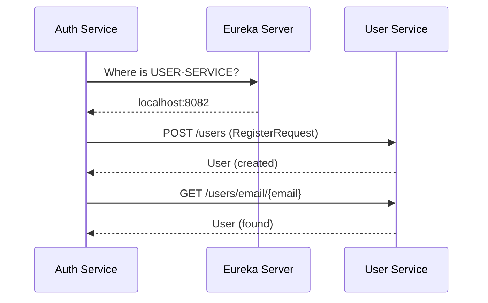
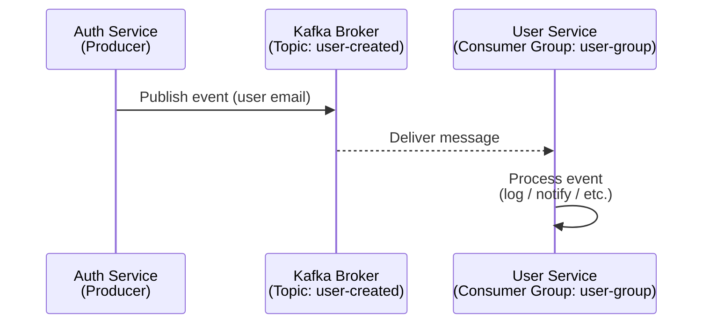
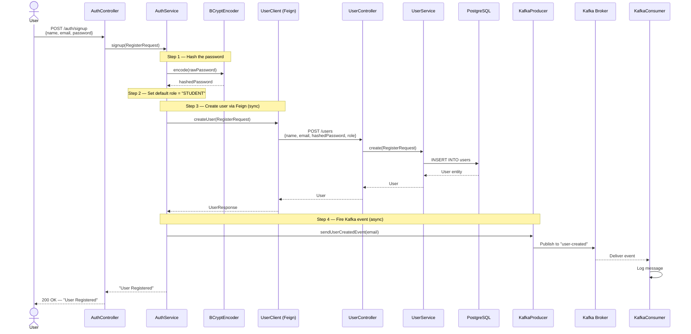
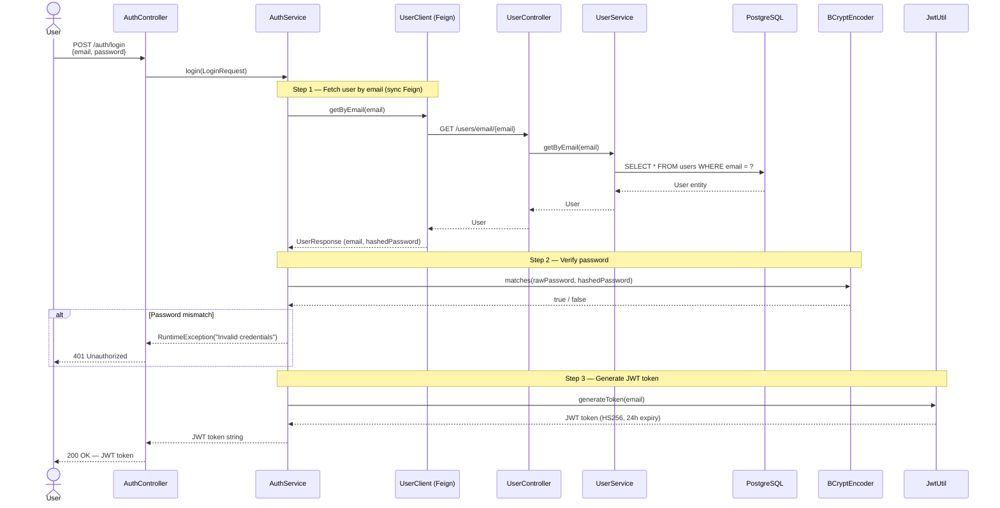
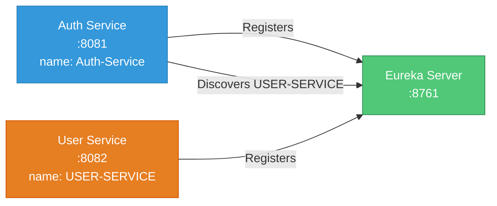
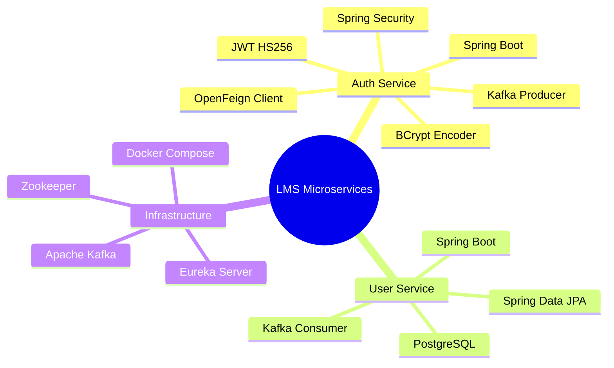

# Working Method Architecture — Auth Service & User Service

> How the **Auth Service** and **User Service** communicate and work together inside the LMS microservice ecosystem.

---

## Table of Contents

- [System Overview](#system-overview)
- [High-Level Architecture](#high-level-architecture)
- [Service Responsibilities](#service-responsibilities)
- [Communication Patterns](#communication-patterns)
  - [Synchronous — OpenFeign (REST)](#1-synchronous--openfeign-rest)
  - [Asynchronous — Apache Kafka](#2-asynchronous--apache-kafka)
- [Registration Flow (Signup)](#registration-flow-signup)
- [Login Flow](#login-flow)
- [Service Discovery — Eureka](#service-discovery--eureka)
- [Technology Summary](#technology-summary)
- [File Structure Reference](#file-structure-reference)

---

## System Overview

The LMS platform follows a **microservices architecture** with an **event-driven** layer. Two core services handle identity and user management:

| Service | Port | Spring Name | Purpose |
|---------|------|-------------|---------|
| **Auth Service** | `8081` | `Auth-Service` | Authentication (signup, login, JWT) |
| **User Service** | `8082` | `USER-SERVICE` | User CRUD, data persistence (PostgreSQL) |
| **Eureka Server** | `8761` | `EurekaServer` | Service discovery & registry |

---

## High-Level Architecture

```mermaid
graph TB
    subgraph Client
        C[Client / Frontend]
    end

    subgraph Infrastructure
        EU[Eureka Server :8761]
        KF[Apache Kafka :9092]
        ZK[Zookeeper :2181]
        DB[(PostgreSQL :5432<br/>lms_db)]
    end

    subgraph Auth Service [:8081]
        AC[AuthController<br/>/auth/signup  /auth/login]
        AS[AuthService]
        JW[JwtUtil]
        PE[PasswordEncoder<br/>BCrypt]
        KP[KafkaProducerService]
        UC[UserClient<br/>OpenFeign]
    end

    subgraph User Service [:8082]
        UCT[UserController<br/>/users  /users/email/{email}]
        US[UserService]
        UR[UserRepository<br/>JPA]
        KC[KafkaConsumer]
    end

    C -->|HTTP POST| AC
    AC --> AS
    AS --> JW
    AS --> PE
    AS --> UC
    AS --> KP

    UC -->|Feign REST Call| UCT
    UCT --> US
    US --> UR
    UR --> DB

    KP -->|Publish 'user-created'| KF
    KF -->|Consume 'user-created'| KC
    ZK --- KF

    AC -.->|Register| EU
    UCT -.->|Register| EU

    style C fill:#4A90D9,stroke:#2C5F8A,color:#fff
    style EU fill:#50C878,stroke:#2E8B57,color:#fff
    style KF fill:#FF8C42,stroke:#CC6F35,color:#fff
    style DB fill:#9B59B6,stroke:#7D3C98,color:#fff
    style AC fill:#3498DB,stroke:#2980B9,color:#fff
    style UCT fill:#E67E22,stroke:#D35400,color:#fff
```

---

## Service Responsibilities

### Auth Service (Port 8081)

| Component | Class | Responsibility |
|-----------|-------|----------------|
| Controller | `AuthController` | Exposes `/auth/signup` and `/auth/login` endpoints |
| Service | `AuthService` | Orchestrates registration & login logic |
| Feign Client | `UserClient` | Synchronous HTTP calls to User Service |
| JWT Utility | `JwtUtil` | Generates & validates JWT tokens (HS256) |
| Security | `SecurityConfig` | Permits `/auth/**`, BCrypt password encoder |
| Kafka Producer | `KafkaProducerService` | Publishes `user-created` events |

### User Service (Port 8082)

| Component | Class | Responsibility |
|-----------|-------|----------------|
| Controller | `UserController` | Exposes `POST /users` and `GET /users/email/{email}` |
| Service | `UserService` | Creates users, looks up by email |
| Repository | `UserRepository` | JPA repository for `users` table |
| Model | `User` | Entity with `id`, `name`, `email`, `password`, `role`, `provider` |
| Kafka Consumer | `KafkaConsumer` | Listens to `user-created` topic (group: `user-group`) |

---

## Communication Patterns

The two services communicate using **two patterns** simultaneously:

### 1. Synchronous — OpenFeign (REST)

Auth Service uses **Spring Cloud OpenFeign** to make direct HTTP calls to User Service. Eureka handles service discovery so Auth Service resolves `USER-SERVICE` by name (no hardcoded URLs).



**Feign Interface (`UserClient.java`):**

```java
@FeignClient(name = "USER-SERVICE")
public interface UserClient {

    @PostMapping("/users")
    UserResponse createUser(@RequestBody RegisterRequest request);

    @GetMapping("/users/email/{email}")
    UserResponse getByEmail(@PathVariable("email") String email);
}
```

### 2. Asynchronous — Apache Kafka

After a successful signup, Auth Service publishes a `user-created` event to the Kafka topic. User Service consumes this event for post-registration tasks (logging, notifications, etc.).



**Producer (`KafkaProducerService.java`):**

```java
@Service
public class KafkaProducerService {
    @Autowired
    private KafkaTemplate<String, String> kafkaTemplate;

    public void sendUserCreatedEvent(String email) {
        kafkaTemplate.send("user-created", email);
    }
}
```

**Consumer (`KafkaConsumer.java`):**

```java
@Service
public class KafkaConsumer {
    @KafkaListener(topics = "user-created", groupId = "user-group")
    public void listen(String message) {
        System.out.println("Received message: " + message);
    }
}
```

---

## Registration Flow (Signup)

Complete step-by-step flow when a user registers:



---

## Login Flow

Complete step-by-step flow when a user logs in:



---

## Service Discovery — Eureka

Both services register with **Eureka Server** on startup. Auth Service resolves `USER-SERVICE` dynamically through Eureka instead of hardcoding `localhost:8082`.



**Configuration:**

| Property | Auth Service | User Service |
|----------|-------------|-------------|
| `spring.application.name` | `Auth-Service` | `USER-SERVICE` |
| `eureka.client.service-url.defaultZone` | `http://localhost:8761/eureka` | `http://localhost:8761/eureka` |

---

## Technology Summary



| Layer | Technology |
|-------|-----------|
| Framework | Spring Boot |
| Service Discovery | Netflix Eureka |
| Inter-Service Calls | Spring Cloud OpenFeign |
| Async Messaging | Apache Kafka |
| Authentication | JWT (HS256) via `jjwt` |
| Password Hashing | BCrypt (`BCryptPasswordEncoder`) |
| Database | PostgreSQL (`lms_db`) |
| ORM | Spring Data JPA / Hibernate |
| Containerization | Docker Compose (Kafka + Zookeeper) |

---

## File Structure Reference

```
microservice-lms-system-springboot/
├── docker-compose.yml                    # Kafka + Zookeeper
├── EurekaServer/                         # Service Discovery (port 8761)
│
├── AuthService/                          # Authentication (port 8081)
│   └── src/main/java/site/shazan/AuthService/
│       ├── Controller/
│       │   └── AuthController.java       # /auth/signup, /auth/login
│       ├── Service/
│       │   ├── AuthService.java          # Signup & login orchestration
│       │   └── KafkaProducerService.java # Publishes 'user-created' events
│       ├── Dtos/
│       │   ├── RegisterRequest.java      # name, email, password, role
│       │   ├── LoginRequest.java         # email, password
│       │   └── UserResponse.java         # email, password
│       ├── repo/
│       │   └── UserClient.java           # Feign client → USER-SERVICE
│       ├── utils/
│       │   └── JwtUtil.java              # JWT generate & extract
│       └── config/
│           └── SecurityConfig.java       # BCrypt, permitAll /auth/**
│
└── UserService/                          # User Management (port 8082)
    └── src/main/java/site/shazan/UserService/
        ├── controller/
        │   └── UserController.java       # POST /users, GET /users/email/{email}
        ├── service/
        │   └── UserService.java          # create(), getByEmail()
        ├── dtos/
        │   ├── RegisterRequest.java      # name, email, password, role
        │   └── UserResponse.java         # email, password
        ├── models/
        │   └── User.java                 # JPA entity (users table)
        ├── repo/
        │   └── UserRepository.java       # JPA repository
        └── kafka/
            └── KafkaConsumer.java        # Listens to 'user-created' topic
```

---

> **Key Takeaway:** Auth Service is stateless — it owns **no database**. It delegates all user persistence to User Service via **OpenFeign** (synchronous REST) and broadcasts lifecycle events via **Kafka** (asynchronous messaging). Eureka Server enables dynamic service discovery so no URLs are hardcoded between services.
